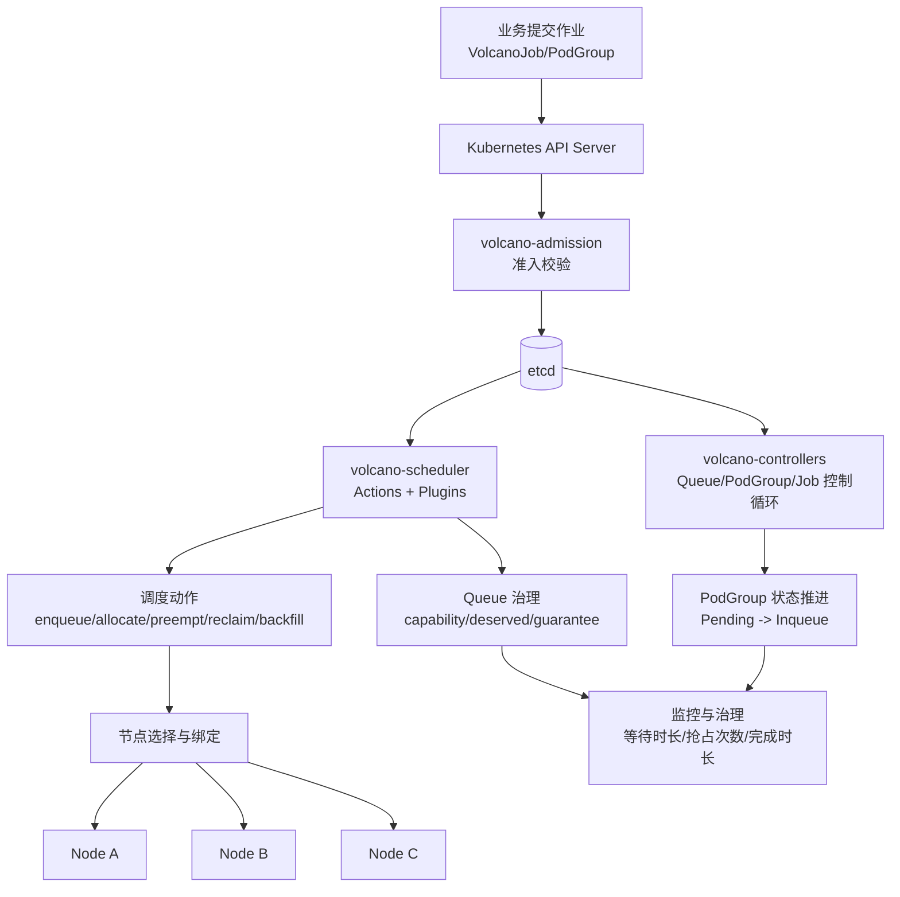

# EAP-0003 Volcano 调度器架构图

日期：2026-03-26

## 组件说明

1. `volcano-admission`：在资源进入集群前进行校验，降低无效作业进入概率。
2. `volcano-controllers`：推进 Queue/PodGroup/VolcanoJob 等对象状态。
3. `volcano-scheduler`：根据动作链与插件链完成队列准入、节点打分、绑定与资源治理。
4. Queue 与 PodGroup 共同决定“谁能进队”和“何时整组启动”。

