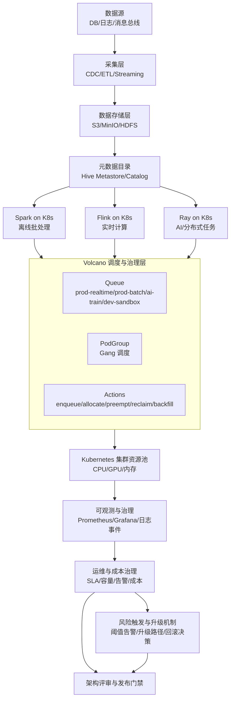

# EAP-0005 Volcano 与大数据融合架构图

日期：2026-03-26

## 说明

1. Spark/Flink/Ray 统一通过 Volcano 调度，实现多引擎资源治理一致性。
2. Queue 承载租户与业务域隔离，PodGroup 保障分布式任务整组可运行。
3. 可观测层对排队、失败、抢占、回收等关键事件提供统一视图。
4. 风险触发与升级机制与发布门禁联动，确保命中阈值时可快速回滚。
